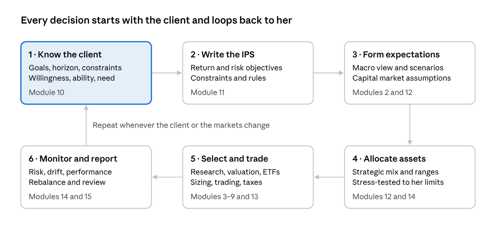

# Start here

Win the case by making every holding trace back to the client's own words. This course teaches the full private-banking chain: understand the client, write the Investment Policy Statement (IPS), build the portfolio, manage its risk and defend it to judges.

## The one rule: fit beats return

In a case-based competition, a portfolio is judged on how well it serves the client's goals, risk tolerance and constraints, and on the reasoning behind it. Raw return matters far less than fit. For a conservative, risk-averse client like Laura Gao, capital preservation, inflation protection, liquidity and steady income usually outrank upside.

## The portfolio management process

Private banks, endowments and the CFA curriculum all run the same six-step loop. Every module in this course plugs into one step of it.

*The portfolio management process · 6 steps in a loop*

Steps 1 and 2 decide what the portfolio must do, steps 3 to 5 build it, and step 6 checks it against the IPS.

## Course map

| Module | You will be able to | Feeds this part of your submission |
| --- | --- | --- |
| [1 · Investment foundations](01-investment-foundations.md) | Explain return, risk, compounding and every major asset class | Rationale, client education |
| [2 · Economics for investors](02-economics-for-investors.md) | Read the macro regime and link it to asset classes | Market outlook |
| [3 · Business management and strategy](03-business-management-and-strategy.md) | Judge business quality with Five Forces, moats and governance | Stock theses |
| [4 · Financial statements and analytics](04-financial-statements-and-business-analytics.md) | Compute and interpret ratios, spot accounting red flags | Stock theses |
| [5 · Analyzing company growth](05-analyzing-company-growth.md) | Measure growth and judge whether it creates value | Stock theses |
| [6 · Equity valuation](06-equity-valuation.md) | Value a company with DCF, dividend discount and multiples | Buy and sell decisions |
| [7 · Fixed income and TIPS](07-fixed-income-and-tips.md) | Analyze bonds, duration, credit and inflation protection | Bond and TIPS sleeve |
| [8 · ETFs, funds and index investing](08-etfs-funds-and-index-investing.md) | Choose ETFs on cost, tracking, liquidity and fit | Core holdings |
| [9 · Alternatives and real assets](09-alternatives-and-real-assets.md) | Decide whether REITs, gold or alternatives belong | Diversifiers |
| [10 · Know your client](10-know-your-client.md) | Turn the case file into goals and a risk profile | Client profile |
| [11 · Building the IPS](11-investment-policy-statement.md) | Write a measurable, defensible IPS | IPS section |
| [12 · Portfolio theory and asset allocation](12-portfolio-theory-and-asset-allocation.md) | Build and justify an asset allocation | Allocation section |
| [13 · Construction and implementation](13-portfolio-construction-and-implementation.md) | Pick, size, trade and rebalance holdings | Holdings, trade log |
| [14 · Risk assessment and management](14-risk-assessment-and-management.md) | Measure, stress-test and manage risk | Risk section |
| [15 · Performance and reporting](15-performance-measurement-and-reporting.md) | Measure results correctly and report them | Results, monitoring plan |
| [16 · Competition playbook](16-competition-playbook.md) | Run the case workflow and answer judges | Report, presentation, Q&A |
| [Appendix · Worked example](17-appendix-worked-example.md) | Follow one full case from profile to portfolio | A model to imitate |

## How to study it

- **Short on time?** Read Modules 10, 11, 12, 14 and 16 first. They are the critical path for the case.
- **Split by role.** Equity analysts take Modules 3 to 6, the fixed-income lead takes 7, and the ETF and risk lead takes 8, 9 and 14.
- **Keep the booklet open.** Every formula and a glossary of terms and acronyms live in the [formula booklet](../booklet/formulas.md) and the [key-terms glossary](../booklet/key-terms.md).
- **Apply as you go.** Each module ends with "Apply it to your case". Do those steps on the Laura Gao file before moving on.

## Conventions

- Figures labelled "approximate" are rounded long-run historical numbers for teaching. Check current data before you cite any number in your report.
- "Banker's note" callouts are practitioner tips from the private-banking desk.
- Tickers are examples to research, never recommendations. Verify fees and holdings on the issuer's website.

---

[Course contents](README.md) · [Module 1 · Investment foundations →](01-investment-foundations.md)
