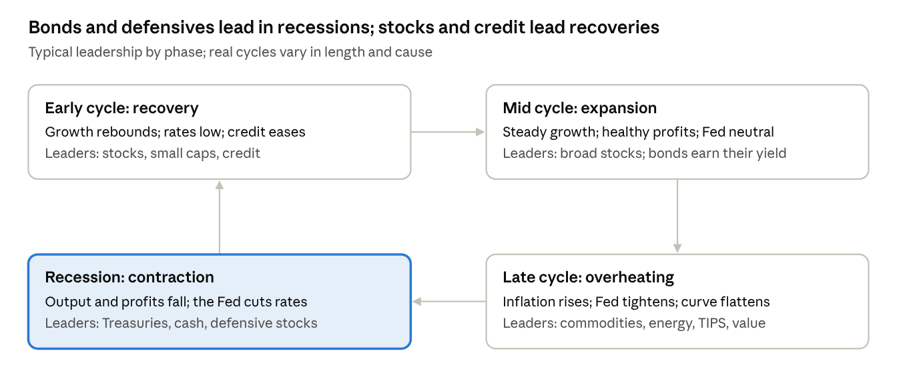

# Module 2 · Economics for investors

Macroeconomics sets the tide for every asset class. You do not need to forecast it precisely. You need to know which regime you are in, and to build a portfolio that survives the regimes you did not predict.

## 2.1 The indicators that matter

| Indicator | What it measures | Released | How investors read it |
| --- | --- | --- | --- |
| Real GDP growth | Output of the economy after inflation | Quarterly (BEA) | Two negative quarters is a popular rule of thumb, but the NBER dates US recessions from a broader set of data |
| Unemployment rate and nonfarm payrolls | Labor market health | Monthly, usually the first Friday (BLS) | The Sahm rule flags recession when the 3-month average unemployment rate rises 0.5 points above its low of the prior 12 months |
| CPI and core CPI | Consumer prices; core excludes food and energy | Monthly (BLS) | Drives TIPS principal, Fed policy and bond yields |
| PCE price index | The inflation measure behind the Fed's 2% target | Monthly (BEA) | The Fed's preferred gauge |
| PPI | Prices producers receive | Monthly (BLS) | Early read on pipeline inflation and profit margins |
| ISM manufacturing and services PMI | Purchasing-manager survey; 50 separates expansion from contraction | Monthly | Leads the earnings cycle |
| Retail sales and consumer sentiment | Consumer spending, roughly two-thirds of US GDP | Monthly | Strength of demand |
| Initial jobless claims | New unemployment filings | Weekly (Department of Labor) | The fastest labor-market signal |
| Housing starts and permits | New construction | Monthly | A rate-sensitive leading sector |
| Yield curve (10-year minus 2-year, 10-year minus 3-month) | Long rates vs short rates | Daily (Treasury) | Inversion has preceded most US recessions |
| High-yield credit spreads | Extra yield on risky corporate debt | Daily | Widening signals financial stress |
| Leading Economic Index | Composite of leading indicators | Monthly (Conference Board) | Helps spot turning points |

## 2.2 GDP and growth

```math
GDP = C + I + G + (X - M)
```

- **Components:** consumption, investment, government spending and net exports (exports minus imports).
- **Nominal vs real:** nominal GDP is measured at current prices; real GDP strips out inflation. The GDP deflator is nominal ÷ real × 100.
- **Potential output and the output gap:** when the economy runs above its potential, inflation tends to rise; when it runs below, there is slack and inflation tends to fall.
- **Long-run growth:** labor-force growth plus productivity growth, roughly 2% a year in real terms for the US (approximate). Long-run nominal GDP growth caps the terminal growth rate you can assume in a DCF ([Module 6](06-equity-valuation.md)).

## 2.3 The business cycle

Economies move through recovery, expansion, overheating and recession. Each phase favors different assets, which is the logic behind sector rotation and tactical allocation.



*The business cycle · 4 phases and the assets that tend to lead*

Treat these as tendencies, not rules. Phases vary in length, and the drivers matter. In 2022 an inflation shock hit stocks and bonds at the same time, so the usual recession playbook of long bonds failed.

## 2.4 Inflation

- **Causes:** demand-pull (too much spending chasing too few goods), cost-push (energy or supply shocks), expectations that feed into wages, and monetary expansion (MV = PY).
- **Measures:** headline CPI, core CPI, PCE and core PCE. The Fed targets 2% on PCE.
- **Disinflation, deflation, stagflation:** disinflation is slowing inflation; deflation is falling prices; stagflation is high inflation with weak growth, the worst regime for a stock-and-bond portfolio.
- **Breakeven inflation:** a nominal Treasury yield minus the TIPS real yield of the same maturity. It is the market's inflation expectation plus risk premia ([Module 7](07-fixed-income-and-tips.md)).

| Asset | When inflation runs high or surprises upward | Why |
| --- | --- | --- |
| Cash | Keeps up only as fast as short rates rise | Rates reset, but with a lag |
| Nominal bonds | Hurt | Fixed payments lose value and yields rise |
| TIPS | Protected against realized inflation | Principal tracks CPI, but prices still fall if real yields rise |
| Stocks | Mixed | Firms with pricing power pass costs on; valuations fall as rates rise |
| Real estate | Partial hedge | Rents reset, but property is rate-sensitive |
| Commodities | Tend to benefit, especially from surprises | They are often the source of the inflation |
| Gold | Mixed in the short run | Tends to do well when real interest rates fall |

## 2.5 Monetary policy and the Federal Reserve

- **Mandate:** maximum employment and stable prices (the dual mandate), with a 2% inflation goal.
- **The FOMC:** the 7 governors plus the New York Fed president and 4 rotating regional presidents vote. It meets 8 times a year and publishes the Summary of Economic Projections, including the "dot plot" of rate forecasts, at 4 of those meetings.
- **Tools:** the federal funds target range, interest on reserve balances, open market operations, the balance sheet (quantitative easing buys bonds to push long rates down; quantitative tightening shrinks holdings), the discount window and forward guidance.
- **Transmission:** the policy rate moves short-term rates, borrowing costs, asset prices, the dollar and expectations, which then move spending, hiring and inflation. The effects arrive with long and variable lags, often a year or more.
- **Reading the Fed:** "hawkish" leans toward higher rates to fight inflation; "dovish" leans toward lower rates to support growth. Fed funds futures (summarized by CME FedWatch) show the path the market expects.
- **Taylor rule:** a benchmark for where the policy rate "should" be, given inflation and the output gap (formula in the booklet).
- **Portfolio impact:** rising rates hurt long-duration assets (long bonds, high-valuation growth stocks); cuts help them. Cash yields follow the policy rate down as well as up.

## 2.6 Fiscal policy

- **Levers:** government spending and taxes. Deficits are financed by issuing Treasuries, which adds to the supply of bonds.
- **Multiplier and crowding out:** spending can lift GDP by more than its cost, but heavy borrowing can push up rates and crowd out private investment.
- **Automatic stabilizers:** unemployment insurance and progressive taxes cushion recessions without new legislation.
- **Market impact:** large, persistent deficits can raise long-term yields through the term premium. All three major agencies now rate US debt one notch below AAA (S&P in 2011, Fitch in 2023, Moody's in 2025).

## 2.7 Interest rates and the yield curve

- **Shapes:** normal (upward sloping), flat, inverted (short rates above long rates) and humped.
- **Why it slopes:** expectations theory says long rates average the expected short rates; liquidity preference adds a term premium for lending longer; preferred habitat says different investors favor different maturities.
- **As a signal:** inversions have preceded most US recessions of the past 60 years, with lags of roughly 6 to 24 months. The long 2022–24 inversion was not followed by a recession within that window, a reminder that it is a signal, not a schedule.
- **Real vs nominal:** nominal yield ≈ real yield + expected inflation + inflation risk premium. Treasury publishes both nominal and TIPS real yield curves daily.

## 2.8 Global macro and currencies

- **What moves exchange rates:** interest-rate differentials, inflation differentials (purchasing power parity), relative growth, risk appetite, trade balances and capital flows.
- **Your return in dollars:** (1 + local return) × (1 + currency return) − 1. A 10% gain in European stocks becomes about 4.5% if the euro falls 5% against the dollar.
- **Hedging:** currency swings dominate the volatility of foreign bonds, so foreign bonds are usually held currency-hedged. For foreign stocks, leaving currency unhedged is common because it adds diversification.
- **Emerging markets:** faster growth, but more political, currency, governance and liquidity risk.
- **Global shocks:** tariffs and trade policy, geopolitics, oil supply decisions, China's growth, and other central banks (ECB, Bank of Japan, Bank of England).
- **The dollar:** as the world's reserve currency, it has usually risen in global crises, which cushions US investors holding foreign assets.

## 2.9 Microeconomics for analysts

- **Elasticity:** if demand barely falls when price rises (inelastic demand), the company has pricing power. That is the single most useful micro idea for stock analysis.
- **Costs:** fixed vs variable costs determine operating leverage, meaning how much profit swings when sales swing. Profit is maximized where marginal revenue equals marginal cost.
- **Scale and networks:** economies of scale lower unit costs as volume grows; network effects make a product more valuable as more people use it.
- **Opportunity cost:** every investment competes with the next-best alternative. For a conservative client, that hurdle is the T-bill rate.
- **Game theory:** price wars are a prisoner's dilemma; industries with a few rational players tend to avoid them.

| Market structure | Number of firms | Pricing power | Typical margins | Examples |
| --- | --- | --- | --- | --- |
| Perfect competition | Many, identical products | None (price takers) | Thin | Grain farming |
| Monopolistic competition | Many, differentiated products | Some, via brand | Moderate | Restaurants, apparel |
| Oligopoly | A few, interdependent | Significant | Healthy | Wireless carriers, card networks |
| Monopoly | One | High, often regulated | High or capped by regulators | Regulated utilities |

## 2.10 Building your macro view

Write the view in five lines, then turn it into scenarios:

1. **Growth:** where are we in the cycle, and what do the leading indicators say?
2. **Inflation:** the trend, and what breakevens expect.
3. **Policy:** the Fed's projected path vs what futures markets price in.
4. **Valuations:** stock multiples vs history, bond yields vs inflation, credit spreads vs average.
5. **Risks:** what would break the base case?

| Scenario | What happens | Typical effect on assets | What protects the client |
| --- | --- | --- | --- |
| Soft landing | Growth slows but stays positive; inflation drifts toward target | Stocks and bonds both earn positive returns | The core allocation |
| Recession | Unemployment rises, profits fall, the Fed cuts | Stocks fall; Treasuries and cash gain | High-quality bonds, cash reserve |
| Inflation resurgence | Inflation re-accelerates; rates rise | Stocks and bonds fall together, as in 2022 | Short duration, T-bills, TIPS, real assets |
| Productivity boom | Strong growth with tame inflation | Stocks rally; bonds flat | Equity sleeve, rebalancing discipline |

Assign your own probabilities, then check that the portfolio is acceptable in every row, not just the likeliest one.

## 2.11 Where to get the data

- [FRED](https://fred.stlouisfed.org) (St. Louis Fed): nearly every US and many global series, free and downloadable.
- BLS (CPI, jobs), BEA (GDP, PCE) and the Federal Reserve (FOMC statements, minutes, projections).
- US Treasury: daily nominal and real (TIPS) yield curves.
- CME FedWatch: market-implied odds of Fed moves.
- J.P. Morgan Guide to the Markets: a quarterly chart book, ideal for a market-outlook section.

## Apply it to your case

- Write your five-line macro view and one scenario table for the report.
- For each scenario, estimate Laura's portfolio return ([Module 14](14-risk-assessment-and-management.md) shows how).
- Make sure the portfolio survives the scenario that is least likely but most damaging. For a conservative client that is usually a 2022-style inflation shock or a 2008-style crash.

---

[← Module 1 · Investment foundations](01-investment-foundations.md) · [Course contents](README.md) · [Module 3 · Business management and strategy →](03-business-management-and-strategy.md)
