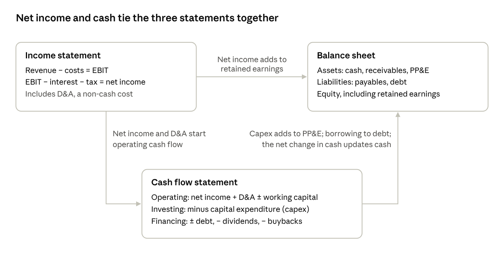

# Module 4 · Financial statements and business analytics

The three financial statements show how a company makes money, what it owns and owes, and whether its profits turn into cash. Ratios turn them into signals you can compare across years and against peers.

## 4.1 The three statements and how they connect

- **Income statement (over a period):** revenue − cost of goods sold = gross profit; − operating expenses (selling, general and administrative; research and development) = operating income (EBIT); − interest = pretax income; − taxes = net income. EBITDA adds back depreciation and amortization.
- **Balance sheet (at a point in time):** assets = liabilities + shareholders' equity. Working capital = current assets − current liabilities.
- **Cash flow statement (over a period):** operating cash flow (CFO) starts from net income, adds back non-cash charges and adjusts for working capital; investing cash flow (CFI) covers capex and acquisitions; financing cash flow (CFF) covers debt, dividends, buybacks and share issuance.



*How the three financial statements link · 3 statements, 3 links*

If you can trace a change in one statement to the other two, you understand the business mechanically. That is the test analysts use in interviews, and it is how you catch numbers that do not add up.

## 4.2 Where to find the data

- **Filings, free on SEC EDGAR:** the 10-K (audited annual report), 10-Q (quarterly), 8-K (material events), DEF 14A (proxy: pay and board), S-1 (IPO registration) and 20-F (foreign companies).
- **Company sources:** earnings releases, call transcripts and investor-day presentations on the investor-relations site.
- **Read a 10-K in this order:** business description → risk factors → management's discussion and analysis (MD&A) → financial statements → footnotes (revenue recognition, debt maturities, leases, segments, stock compensation, contingencies).

## 4.3 The ratio toolkit

Rules of thumb vary by industry; always compare with peers and the company's own history. Full formulas are in the booklet.

| Category | Ratio | Formula | What it tells you |
| --- | --- | --- | --- |
| Profitability | Gross margin | Gross profit ÷ revenue | Pricing power and production cost |
| Profitability | Operating margin | EBIT ÷ revenue | Core profitability before financing |
| Profitability | Return on assets (ROA) | Net income ÷ average total assets | How well assets produce profit |
| Profitability | Return on equity (ROE) | Net income ÷ average equity | Shareholder return; inflated by leverage |
| Profitability | Return on invested capital (ROIC) | After-tax operating profit (NOPAT) ÷ (debt + equity − cash) | The best single quality measure; compare with WACC |
| Efficiency | Asset turnover | Revenue ÷ average assets | Sales generated per dollar of assets |
| Efficiency | Days sales outstanding (DSO) | Receivables ÷ revenue × 365 | How fast customers pay |
| Efficiency | Days inventory outstanding (DIO) | Inventory ÷ cost of goods sold × 365 | How long stock sits on shelves |
| Efficiency | Days payables outstanding (DPO) | Payables ÷ cost of goods sold × 365 | How long the firm takes to pay suppliers |
| Efficiency | Cash conversion cycle | DSO + DIO − DPO | Days cash is tied up in operations |
| Liquidity | Current ratio | Current assets ÷ current liabilities | Short-term bills covered; above 1 is typical |
| Liquidity | Quick ratio | (Cash + securities + receivables) ÷ current liabilities | Same, without inventory |
| Leverage | Net debt to EBITDA | (Debt − cash) ÷ EBITDA | Years of profit to repay debt; under 2–3× is comfortable for most non-financials |
| Leverage | Interest coverage | EBIT ÷ interest expense | Safety of interest payments; above 5× is comfortable |
| Cash flow | Free cash flow (FCF) | Operating cash flow − capex | Cash left for owners |
| Cash flow | FCF conversion | FCF ÷ net income | Earnings quality; near 100% is healthy |
| Payout | Payout ratio | Dividends ÷ net income (or ÷ FCF) | Dividend safety; lower leaves more cushion |

## 4.4 DuPont analysis: where ROE really comes from

```math
ROE = \frac{\text{Net income}}{\text{Sales}} \times \frac{\text{Sales}}{\text{Assets}} \times \frac{\text{Assets}}{\text{Equity}}
```

Company A earns a 20% net margin with asset turnover of 0.8 and leverage of 1.25: ROE = 20%. Company B earns a 5% margin with turnover of 1.0 and leverage of 4.0: ROE is also 20%. The same ROE hides very different risk. B depends on borrowed money, so a small fall in margins hits its equity far harder. A conservative client should prefer A.

The five-step version splits the margin further: ROE = tax burden (net income ÷ pretax income) × interest burden (pretax income ÷ EBIT) × operating margin × asset turnover × leverage.

## 4.5 Earnings quality and red flags

| Red flag | What it may mean | How to check |
| --- | --- | --- |
| Net income growing much faster than operating cash flow | Profits not turning into cash | CFO ÷ net income over 3–5 years |
| Receivables growing faster than revenue | Pushing product onto customers, loose credit | DSO trend |
| Inventory growing faster than sales | Weak demand, obsolete stock | DIO trend |
| Capitalizing costs that peers expense | Profits flattered | Accounting-policy footnote |
| "One-time" charges every year | Recurring costs hidden as unusual | Restructuring history |
| Large gap between GAAP and adjusted earnings | Heavy exclusions such as stock-based pay | Non-GAAP reconciliation |
| Goodwill large relative to equity | Overpaid acquisitions; write-down risk | Goodwill ÷ equity |
| Off-balance-sheet obligations | Hidden leverage | Commitments and contingencies note |
| Auditor change, late filing or restatement | Weak controls | 8-K and late-filing notices |
| Clusters of insider selling | Insiders see limited upside | Form 4 filings |

Three scoring models give a quick screen (formulas in the booklet): the Altman Z-score for bankruptcy risk, the Piotroski F-score for financial strength, and the Beneish M-score for possible earnings manipulation.

## 4.6 Industry KPIs

| Industry | Metrics that matter |
| --- | --- |
| Software (SaaS) | Annual recurring revenue, net revenue retention, customer acquisition cost payback, Rule of 40 (growth % + FCF margin % of 40 or more) |
| Retail | Same-store sales, sales per square foot, inventory turns, online share |
| Restaurants | Same-store sales split into traffic and average ticket, unit growth, restaurant-level margin |
| Banks | Net interest margin, efficiency ratio, CET1 capital ratio, non-performing loans, loan-to-deposit ratio |
| Insurance | Combined ratio (below 100% means an underwriting profit), investment yield, reserve development |
| REITs | Funds from operations (FFO) and adjusted FFO per share, occupancy, same-store net operating income, debt to EBITDA |
| Oil and gas | Production, reserve life, breakeven oil price, reinvestment rate |
| Utilities | Rate-base growth, allowed return on equity, regulatory lag |
| Airlines | Load factor, revenue and cost per available seat mile |
| Semiconductors | Book-to-bill ratio, gross margin, factory utilization |
| Telecom | Average revenue per user, churn, subscriber additions |
| Consumer staples | Organic growth split into volume and price/mix, market share |
| Pharma and biotech | Pipeline stages, patent expiries, R&D productivity |

## 4.7 Business analytics toolkit

- **Four levels of analytics:** descriptive (what happened), diagnostic (why), predictive (what will happen) and prescriptive (what to do about it).
- **Techniques:** horizontal analysis (trends over time), vertical or common-size analysis (each line as a percentage of revenue or assets), peer comparison tables, regression (beta, factor exposures), scenario and sensitivity analysis, Monte Carlo simulation and cohort analysis.
- **Statistics you will use:** mean, median, standard deviation, covariance, correlation (−1 to +1), regression slope and R², t-statistics, the normal distribution (68–95–99.7 rule), skewness (lopsided returns) and kurtosis (fat tails).
- **Biases to avoid:** survivorship bias (failed funds vanish from databases), look-ahead bias (using data not available at the time), data mining (finding patterns in noise), tiny samples, and mistaking correlation for causation.
- **Spreadsheet skills:** XLOOKUP or INDEX-MATCH, SUMIFS, pivot tables, STDEV.S, CORREL, SLOPE (for beta), XIRR, XNPV, data tables for sensitivity, Goal Seek and Solver. Google Sheets' GOOGLEFINANCE function pulls prices. The booklet's section K lists them all.
- **Free data sources:** SEC EDGAR, company investor-relations sites, FRED, Yahoo Finance, stockanalysis.com, Macrotrends, Koyfin (free tier), the Finviz screener and Portfolio Visualizer (backtests, Monte Carlo, efficient frontiers).

## 4.8 One-page company tear sheet

Use the same template for every stock so the team can compare candidates side by side.

| Section | What to fill in |
| --- | --- |
| Snapshot | Name, ticker, sector, market cap, what it does in one sentence |
| Five-year trend | Revenue, operating margin, EPS, free cash flow, ROIC |
| Balance sheet | Net debt to EBITDA, interest coverage, credit rating |
| Shareholder returns | Dividend yield, dividend growth, payout ratio, net buybacks |
| Valuation | P/E, EV/EBITDA and FCF yield vs the 5-year average and peers |
| Quality | Moat, Five Forces verdict, management and governance notes |
| Risks | Top three risks and what would make us sell |
| Verdict | Buy, hold or avoid; target weight; role in the client's portfolio |

## Apply it to your case

- Build a tear sheet for each stock candidate and put them in your report's appendix.
- Give extra scrutiny to any company with net debt above 3× EBITDA or free-cash-flow conversion below 80%. A conservative client should not carry balance-sheet risk.

---

[← Module 3 · Business management and strategy](03-business-management-and-strategy.md) · [Course contents](README.md) · [Module 5 · Analyzing company growth →](05-analyzing-company-growth.md)
