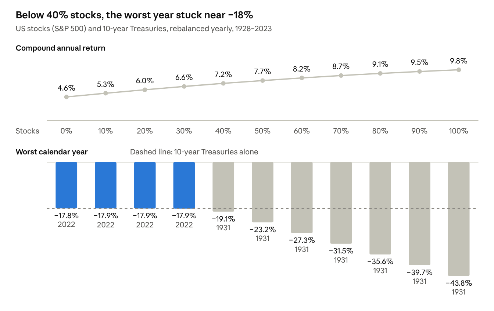

# Module 10 · Know your client

The portfolio can only be as good as your understanding of the client. Extract every goal, constraint and fear from the case file before you touch a single security, and put numbers on them so the IPS can be measured.

## 10.1 Discovery: what to pull out of the case file

| Area | What to record | Feeds this IPS section |
| --- | --- | --- |
| Personal | Age, family, dependents, career, life stage; health only as it affects the horizon | Background, time horizon |
| Income and spending | Salary and its stability, other income (pension, rent), annual spending, savings rate | Return need, liquidity |
| Balance sheet | Assets by type and account (taxable, 401(k), traditional or Roth IRA, 529, HSA), debts and their rates, home equity, net worth | Ability to bear risk, taxes |
| Goals | What, how much, when, and priority (need, want or wish) | Return objective, time horizon |
| Liquidity | Emergency reserve, known withdrawals with amounts and dates, possible surprises | Liquidity constraint |
| Taxes | Federal and state brackets, account types, unrealized gains, residency | Tax constraint |
| Legal and regulatory | Trusts, custodial accounts, employer trading restrictions, insider status | Legal constraint |
| Unique circumstances | Concentrated stock, inheritance, business ownership, ESG values, family obligations, charitable plans | Unique circumstances |
| Attitudes | Reactions to past losses, investment knowledge, stated fears, direct quotes | Willingness to take risk |

> **Banker's note:** Quote the client's own words in your report ("I don't want to lose money") and tie each major decision back to a quote. Judges notice when the portfolio visibly answers the client.

## 10.2 Goals-based planning

Separate the client's money into buckets, each with its own horizon and risk level:

1. **Safety (0–3 years):** the emergency reserve and known near-term spending, held in cash, T-bills, CDs or short Treasuries.
2. **Income and stability (3–10 years):** bond ladders, short and intermediate bonds, TIPS.
3. **Growth (10+ years):** diversified stocks to beat inflation over the long run.
4. **Legacy or aspirational (optional):** the longest horizon, so it can carry the most risk.

Clients think in mental accounts. Knowing the next three years of spending are safe makes it far easier to hold stocks through a crash. Rank goals as needs (must be funded), wants and wishes, and fund the needs with the safest assets.

## 10.3 Quantifying goals and the required return

- **Future cost** = today's cost × (1 + inflation)^years.
- **Required return:** the rate at which today's assets plus planned savings grow into the goal. Solve it with RATE in a spreadsheet, or with Goal Seek when there are several cash flows.
- **Example:** a client has \$250,000, saves \$10,000 a year and wants \$500,000 in 10 years. The required return is 4.24% a year. With 2.5% inflation that is only about 1.7% real, which a conservative mix can reasonably target.
- **If the required return exceeds what the client's risk tolerance allows:** save more, work longer, spend less, move the date or shrink the goal. Do not simply add risk.
- **Shortfall risk is real for the over-cautious.** A portfolio earning 3% when 4.5% is needed fails slowly but surely.

## 10.4 Risk profiling: willingness, ability and need

| Dimension | What it means | How to assess it | Signs of low tolerance |
| --- | --- | --- | --- |
| Willingness (risk attitude) | Psychological comfort with losses | Questionnaires, behavior in 2008, 2020 and 2022, the language in the case | "Can't sleep", sold in a crash, prefers guarantees |
| Ability (risk capacity) | Financial capacity to absorb losses without derailing goals | Horizon, wealth relative to needs, income stability, liquidity needs, insurance, debt | Short horizon, large near-term withdrawals, unstable income, thin cushion |
| Need (required return) | The return needed to reach the goals | The required-return calculation | Goals already funded at low returns, so no need to take risk |

- **When willingness and ability disagree,** the CFA Institute approach generally adopts the more conservative of the two. If low willingness threatens the goals, educate the client about shortfall risk rather than overriding them.
- **Put tolerance into numbers:** the largest acceptable calendar-year loss in percent and dollars, a volatility target, a maximum drawdown and a minimum probability of reaching the goal.
- **Ask in dollars:** "Your \$500,000 portfolio could fall to \$450,000 in a bad year. Would you stay invested?" Dollar framing draws more honest answers than percentages.

| Profile | Typical share in stocks | Primary objective | Typical client |
| --- | --- | --- | --- |
| Conservative | 20–35% | Preserve capital and purchasing power | Short horizon or low willingness; retirees drawing income |
| Moderately conservative | 35–50% | Income with some growth | Near-retirees |
| Moderate (balanced) | 50–65% | Balance growth and stability | Mid-career, medium horizon |
| Moderately aggressive | 65–80% | Growth | Long horizon, stable income |
| Aggressive | 80–100% | Maximum long-run growth | Young, with high capacity and willingness |

These ranges are conventions, not rules. History shows what each mix of US stocks and 10-year Treasuries has actually delivered:

*Computed from Damodaran Online annual returns, 1928–2023 · yearly rebalancing, no fees or taxes*

Two lessons follow for a risk-averse client. Bonds cut the worst year sharply only until about 40% stocks; below that, the floor is set by the bonds themselves. And the stock-bond relationship changes: in annual data their correlation was +0.15 from 1928 to 1999 and −0.65 from 2000 to 2021, and both fell together in 1931, 1941, 1969, 2018 and 2022. Lowering the floor further takes shorter-duration bonds, T-bills and inflation protection, not just more bonds.

## 10.5 Human capital and total wealth

- **Human capital** is the present value of a person's future earnings. A tenured teacher's or civil servant's income is bond-like; a commissioned salesperson's or entrepreneur's is stock-like.
- **Total wealth** = financial capital + human capital. Bond-like human capital lets the financial portfolio hold more stocks; stock-like human capital, especially in the same industry as the portfolio's stocks, calls for fewer.
- **The life cycle:** young investors have large human capital and long horizons. Near retirement, human capital shrinks and the portfolio must replace the paycheck. That is the logic of target-date glide paths.
- **Do not double up:** an employee holding lots of employer stock bets both paycheck and savings on one company.

## 10.6 Planning foundations a private banker checks first

- **Emergency fund:** 3–6 months of expenses (6–12 months for unstable incomes or retirees), in cash and outside the investment portfolio.
- **Insurance:** health, disability, life (if there are dependents), property and umbrella liability.
- **Debt:** pay off high-interest debt such as credit cards before investing; a low-rate mortgage can stay.
- **Tax-advantaged accounts, 2026 limits** ([InvestmentNews, citing the IRS](https://www.investmentnews.com/retirement-planning/irs-reveals-new-401k-ira-contribution-limits-for-2026/263029)): \$24,500 in a 401(k), 403(b) or most 457 plans, plus an \$8,000 catch-up at 50 or older (\$11,250 at ages 60–63); \$7,500 in an IRA plus a \$1,100 catch-up at 50 or older. Roth IRA eligibility phases out between \$153,000 and \$168,000 of income for single filers and between \$242,000 and \$252,000 for married couples filing jointly.
- **Estate basics:** a will, up-to-date beneficiary designations, powers of attorney, a health-care directive, and trusts where appropriate.
- **Retirement income:** the "4% rule" (Bengen, 1994) found that withdrawing 4% of the starting portfolio, raised each year for inflation, lasted at least 30 years in US history. Early losses do the most damage (sequence-of-returns risk). Social Security benefits rise about 8% for each year a claim is delayed past full retirement age, up to 70. Required minimum distributions from traditional IRAs start at 73, rising to 75 for people born in 1960 or later.

## 10.7 Behavioral finance in client conversations

Prospect theory (Kahneman and Tversky, 1979) shows that losses hurt roughly twice as much as equal gains feel good. Expect these biases and plan around them.

| Bias | What it looks like | How to counter it |
| --- | --- | --- |
| Loss aversion | Panic over paper losses; avoiding all risk | Frame decisions in long-run dollars and goal probabilities; agree a drawdown plan in advance |
| Recency bias | Expecting the last few years to continue | Show long history, such as the 1928–2023 record |
| Overconfidence | Overtrading, concentrated bets | Position limits in the IPS |
| Anchoring | Fixating on a purchase price or past peak | Focus on future value, not the entry price |
| Herding and fear of missing out | Chasing hot themes | Require a written thesis for every purchase |
| Disposition effect | Selling winners too early, holding losers too long | Rules-based rebalancing and written sell criteria |
| Mental accounting | Treating money differently by its source | Use it constructively through goal buckets |
| Home bias | Overweighting one's own country | Show the diversification benefit |
| Status quo and regret aversion | Avoiding any decision | A default rebalancing schedule |
| Familiarity | Owning employer stock or favorite brands | Concentration limits |

## 10.8 Client profile template

| Field | What to record |
| --- | --- |
| Snapshot | Name, age, family, occupation, stability of income |
| Investable assets | Amount by account type (taxable, tax-deferred, tax-free) |
| Other assets and liabilities | Home, business, debts and their interest rates |
| Cash flow | Annual income, spending, savings |
| Goals | Each with amount, date, priority, and amount in future dollars |
| Time horizon | Single or multi-stage, in years |
| Liquidity needs | Reserve, scheduled withdrawals, possible surprises |
| Taxes | Brackets, account types, unrealized gains |
| Legal and regulatory | Trusts, restrictions |
| Unique circumstances | Values, concentrations, family, legacy |
| Willingness | Low, below average, average, above average or high, with evidence |
| Ability | Same scale, with evidence |
| Need | Required return, nominal and real |
| Overall risk profile | The final call and why |
| Key quotes | The client's own words that justify the call |

## 10.9 Reading a conservative client

- **What "doesn't like to take risks" means:** low tolerance for visible losses, a preference for stability and income, a high value on liquidity and simplicity, and strong reactions to bad news.
- **What it does not mean:** no stocks at all. Inflation, longevity and shortfall risk punish an all-cash portfolio. In this course's worked example (Appendix), a cash-and-short-bond portfolio had about a 1% chance of reaching the client's goal, against 56% for a conservative diversified mix.
- **Your job:** find the least risky portfolio that still gives a reasonable chance of meeting the goals, and show the client both risks: losing money and missing goals.

## Apply it to your case

- Fill in the client profile template from the Laura Gao file, quoting her words.
- Compute her required return for each goal.
- Rate her willingness, ability and need, and state her overall risk profile with reasons.
- Write her maximum acceptable loss in dollars and percent. It becomes the risk objective in your IPS.

---

[← Module 9 · Alternatives and real assets](09-alternatives-and-real-assets.md) · [Course contents](README.md) · [Module 11 · Building the Investment Policy Statement →](11-investment-policy-statement.md)
