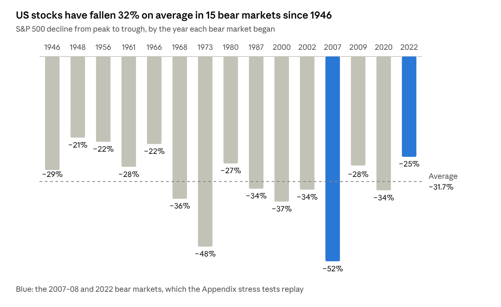

# Module 14 · Risk assessment and management

For a risk-averse client, risk management is the product. Measure risk several ways, stress-test the portfolio in dollars, and show exactly how it is built to survive the scenarios the client fears.

## 14.1 The risk taxonomy

| Risk | What it is | How to measure it | How to manage it |
| --- | --- | --- | --- |
| Equity market | Broad stock declines | Beta, volatility, drawdown | Allocation limits, diversification, quality and low-volatility tilts |
| Interest rate | Bond prices fall as rates rise | Duration, DV01 | Duration targets, ladders, short-term bonds |
| Inflation | Purchasing power erodes | Real returns, sensitivity to inflation | TIPS, real assets, short duration; stocks over the long run |
| Credit | An issuer defaults or is downgraded | Ratings, spreads, expected loss | Investment-grade limits, diversification |
| Liquidity | Cannot sell quickly at a fair price | Bid-ask spreads, volume, days to sell | Daily-liquid holdings, a cash reserve |
| Concentration | Too much in one stock, sector or theme | Weights, top-10 share, Herfindahl index | Position and sector limits |
| Currency | Foreign assets lose value as the dollar rises | Foreign-currency exposure | Hedged foreign bonds; limits on unhedged exposure |
| Reinvestment | Maturing money must be reinvested at lower rates | Share of assets maturing soon | Ladders; some longer duration |
| Longevity | Outliving the money | A plan that runs to age 95 or beyond | Growth assets, annuities, Social Security timing |
| Sequence of returns | Bad returns early in the withdrawal years | Simulation | A cash and bond bucket for 2–5 years of spending |
| Shortfall | Missing the goal | Probability of success | Enough growth assets and savings |
| Behavioral | Panic selling at the bottom | The client's history | The IPS, education, a pre-agreed plan |
| Operational and counterparty | Failure of a custodian, issuer or complex product | Due diligence | Reputable custodians; avoid opaque products |
| Regulatory and tax | Changes in law | Monitoring | Diversify across account types |
| Geopolitical | Wars, sanctions, trade shocks | Scenario analysis | Diversification, Treasuries, cash, gold |

## 14.2 Measuring risk

| Measure | What it tells you | Watch out for |
| --- | --- | --- |
| Standard deviation (volatility) | The typical size of swings; annualize monthly figures by multiplying by √12 | Treats gains and losses alike; assumes a bell curve |
| Downside deviation | Volatility of returns below a target | Needs a chosen target |
| Beta | Sensitivity to the market | Changes over time |
| Maximum drawdown | The worst peak-to-trough fall | Depends on the period studied |
| Value at risk (VaR) | A loss not exceeded with a given confidence | Silent about how bad the tail gets |
| Conditional VaR (expected shortfall) | The average loss in the worst cases | Needs more data |
| Tracking error | Volatility of returns relative to the benchmark | Relative risk only |
| Duration and credit quality | Bond sensitivities | Bonds only |
| Probability of shortfall | The chance of missing the goal | Depends on the assumptions |
| Stress-test loss | The loss in a defined scenario | The choice of scenario matters |

```math
VaR_{95\%} = (1.645\,\sigma - \mu) \times \text{Portfolio value}
```

**Example.** A \$500,000 portfolio has an expected return of 4% and volatility of 7%. VaR = (1.645 × 7% − 4%) × \$500,000 = \$37,575, or 7.5%. In plain English: in about one year out of twenty, the portfolio could lose more than about \$37,600. VaR assumes a bell curve, while real returns have fat tails, and it says nothing about how bad the worst years get. Pair it with conditional VaR and stress tests.

## 14.3 Learning from history: bear markets

A bear market is a fall of 20% or more from a peak. From 1929 to 2022, the S&P 500 suffered 27 of them, one every 3.5 years on average, with an average decline of 35% lasting about 289 days ([Hartford Funds](https://hartfordfunds.com/practice-management/client-conversations/managing-volatility/bear-markets.html)).



*Hartford Funds, S&P 500 bear markets (data as of Dec 2024) · the 15 that began after 1945*

A client with a 10-year horizon will very likely live through at least one. The question is not whether stocks will fall 30%, but whether her portfolio and her nerves can handle it when they do.

## 14.4 Stress testing and scenario analysis

- **Historical scenarios:** replay real episodes such as the 2008 financial crisis, the 2020 COVID crash, the 2022 inflation shock, 1970s stagflation and the 1994 bond rout.
- **Hypothetical scenarios:** define shocks such as rates up 2 points, stocks down 30%, inflation at 6% for two years, credit spreads up 3 points or the dollar up 15%.
- **Method:** portfolio return ≈ the sum of each sleeve's weight × its scenario return. For bonds, estimate the price change as −duration × the change in yield, then add a year of income.
- **Report:** show losses in dollars and percent, next to the IPS risk limit.

The scenario you choose matters. Using calendar-year returns ([Damodaran Online](https://pages.stern.nyu.edu/~adamodar/New_Home_Page/datafile/histret.html)), a portfolio of 30% S&P 500 and 70% 10-year Treasuries **gained 3.1% in 2008**, as Treasuries rallied 20.1% while stocks fell 36.6%. The same portfolio **lost 17.9% in 2022**, when both fell. A "conservative" mix can pass one crisis and fail the next, so always test both a crash and an inflation shock. The Appendix shows a full stress-test table.

## 14.5 Monte Carlo simulation

- **What it does:** generates thousands of possible future paths from expected returns, volatilities and correlations, then counts how often the goal is met.
- **Outputs:** the probability of success, the median outcome, the 5th and 95th percentile outcomes, and the worst drawdowns.
- **Spreadsheet version:** set each year's return to NORM.INV(RAND(), mean, volatility), copy it across 10 years and down 1,000 or more rows, apply contributions and withdrawals, and count the paths that end above the goal. Portfolio Visualizer offers a ready-made Monte Carlo tool.
- **Caveats:** results are only as good as the inputs; bell curves understate fat tails; correlations shift in crises. Present ranges, not false precision.
- **Rule of thumb:** many planners aim for a 70–90% probability of success on essential goals and accept less on aspirational ones.

## 14.6 Risk-adjusted return at a glance

The Sharpe ratio is (return − risk-free rate) ÷ volatility: a 6% return with a 4% risk-free rate and 8% volatility gives 0.25. The Sortino ratio uses downside deviation instead, the Calmar ratio uses maximum drawdown and the Treynor ratio uses beta. [Module 15](15-performance-measurement-and-reporting.md) covers when to use each.

## 14.7 Tools to reduce and hedge risk

| Tool | How it helps | Cost or drawback |
| --- | --- | --- |
| Diversification | Removes company-specific risk | None |
| High-quality bonds and cash | Cushion stock sell-offs in recessions | Lower expected return; bonds can fail in an inflation shock |
| Short duration and T-bills | Limit losses when rates rise | Lower yields when rates fall |
| TIPS | Protect against inflation | Real-rate risk; phantom income |
| Gold and trend-following | Diversify crises and inflation shocks | No income; long dry spells |
| Defensive equity (quality, low volatility, dividend growth) | Smaller drawdowns | Can lag in strong rallies |
| Protective puts | Put a floor under losses | The option premium; a drag if no crash comes |
| Collars | Buy a put paid for by selling a call | Caps the upside |
| Buffered ETFs | Absorb a first slice of losses | Higher fees; capped upside |
| Stop-loss orders | Exit after a set fall | Gaps and whipsaws; selling after the drop |
| Rebalancing and position limits | Keep risk at target | Trading costs and taxes |
| A cash reserve for spending | Avoids forced selling in a downturn | Cash drag |

## 14.8 Sequence-of-returns risk

When a client is withdrawing money, a bad year early does more damage than the same bad year later, because withdrawals lock in the losses. Take \$1,000,000 with \$50,000 withdrawn at the start of each year for 20 years. The returns are identical, one year of −20% and nineteen years of +7%, in a different order:

| When the −20% year arrives | Value after 20 years |
| --- | --- |
| Year 1 | \$748,786 |
| Year 20 | \$1,253,402 |

Without withdrawals, both orders would end at exactly the same \$2,893,222. The defense is to hold 2–5 years of withdrawals in cash and short bonds, spend from that bucket in bad years, refill it in good years, and keep spending flexible.

## 14.9 Managing behavioral risk

- Write the drawdown plan into the IPS: "If stocks fall 20%, we rebalance back to target; we do not sell."
- Show the client the stress tests in dollars before investing.
- Communicate early and often in bad markets: what is happening, and what the plan says to do.
- Keep near-term needs in a separate safe bucket, so the client can see they are covered.

## 14.10 Risk dashboard

| Metric | Example IPS limit | How to compute it |
| --- | --- | --- |
| Share in stocks | 28–38% | Sum of equity weights |
| Expected portfolio volatility | 5–7% | Weights × covariance matrix, or a tool such as Portfolio Visualizer |
| 95% one-year VaR | Below 8% | 1.645 × volatility − expected return |
| Worst stress-test loss | Below 10% | Weighted scenario returns (14.4) |
| Bond duration | 2–5 years | Weighted average of fund durations |
| Average credit quality | A or better | Fund fact sheets |
| Largest single stock | 5% or less | Position weights |
| Largest sector | 25% or less of equities | Sector weights, looking through funds |
| Cash and T-bills | 5–15% | Sum of cash-like weights |
| Probability of meeting the main goal | Agreed with the client | Monte Carlo (14.5) |

## Apply it to your case

- Build Laura's risk dashboard and stress-test table, with losses in dollars.
- Test a 2022-style inflation shock as well as a 2008-style crash. Conservative portfolios built on long-term bonds failed 2022.
- Write her drawdown plan into the IPS.

---

[← Module 13 · Portfolio construction and implementation](13-portfolio-construction-and-implementation.md) · [Course contents](README.md) · [Module 15 · Performance measurement, monitoring and client reporting →](15-performance-measurement-and-reporting.md)
